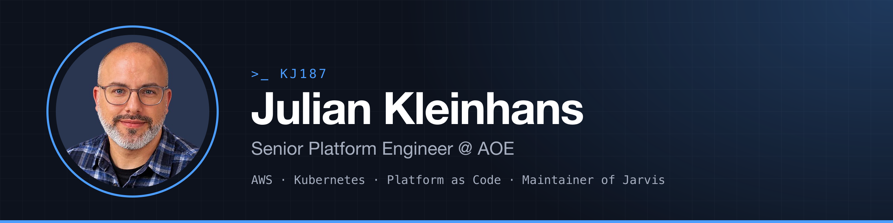

  

## 👋 Hi, I'm Julian

Platform engineer by trade, tinkerer by nature. I design and run **cloud-native platforms on AWS and Kubernetes**, with a focus on automation, observability and security. 20+ years in software, from PHP and TYPO3 to Go and Scala, and since 2016 all in on cloud infrastructure. Platforms are products, and products are written as code.

Currently **Senior Platform Engineer @ [AOE](https://www.aoe.com/)**.

## 🚀 Featured project: Jarvis

[**Jarvis**](https://github.com/kj187/jarvis) is an open-source web frontend for Prometheus Alertmanager, built for on-call teams: interactive, realtime and self-hosted. It is about acting on alerts, not just watching them.

- Realtime alerts via WebSocket, persistent history in SQLite or PostgreSQL
- Claims and comments, silences with preview, multi-cluster and HA
- Single binary, Helm chart included, optional OIDC login
- Go and TypeScript, Apache-2.0, security checks in CI

[Repository](https://github.com/kj187/jarvis) · [Documentation](https://kj187.github.io/jarvis/) · [2½-minute tour](https://www.youtube.com/watch?v=gssfmws8B6o)

## 🏠 Homelab, run like production

Three Proxmox nodes, four VLANs, everything as code: OpenTofu provisions, Ansible configures, Gitea Actions deploy. Prometheus and Alertmanager watch it, and the alerts land in Jarvis. Home Assistant, Frigate and 60+ Shelly devices handle the smart home.

## 📊 GitHub in numbers

  

## 🧰 Tech

**AWS certified:** Solutions Architect – Professional, plus two associate certifications ([Credly](https://www.credly.com/users/julian-kleinhans/badges)).

## 📫 Find me

